# Hole in the Wall
(Developer Gustaaf Milzink)

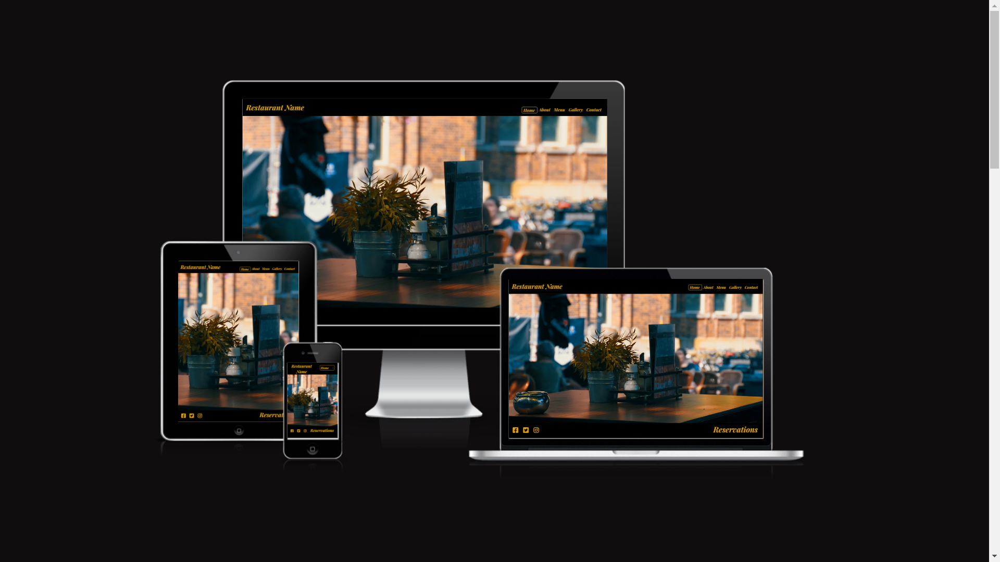

[Live webpage](https://g-milzink.github.io/CI_PP1_TR/index.html)

## Table of Content

1. [Project Goals](#project-goals)
    1. [User Goals](#user-goals)
    2. [Site Owner Goals](#site-owner-goals)
2. [User Experience](#user-experience)
    1. [Target Audience](#target-audience)
    2. [User Requrements and Expectations](#user-requrements-and-expectations)
    3. [User Stories](#user-stories)
3. [Design](#design)
    1. [Design Choices](#design-choices)
    2. [Colour](#colours)
    3. [Fonts](#fonts)
    4. [Structure](#structure)
    5. [Wireframes](#wireframes)
4. [Technologies Used](#technologies-used)
    1. [Languages](#languages)
    2. [Frameworks & Tools](#frameworks-&-tools)
5. [Features](#features)
6. [Testing](#validation)
    1. [HTML Validation](#HTML-validation)
    2. [CSS Validation](#CSS-validation)
    3. [Accessibility](#accessibility)
    4. [Performance](#performance)
    5. [Device testing](#performing-tests-on-various-devices)
    6. [Browser compatibility](#browser-compatability)
    7. [Testing user stories](#testing-user-stories)
8. [Bugs](#Bugs)
9. [Deployment](#deployment)
10. [Credits](#credits)
11. [Acknowledgements](#acknowledgements)

## Project Goals

### User Goals
- Finding a restaurant with an interesting kitchen and get a sense of the atmosphere.
- Having access to the full menu and pricing details.
- Finding extra information about the reastaurant.
- Finding the location of the restaurant.

### Site Owner Goals
- Atracting new customers to the restaurant.
- Presenting information about the restaurant to customers.
- Provide a quick way for new and existing customers to make reservations.
- Promoting the bussines.

## User Experience

### Target Audience
- People looking for a place to dine at
- Groups of people looking for a place to carter an event.

### User Requirements and Expectations

- A simple and intuitive navigation system.
- Links and functions that work as expected.
- Quickly and easily find relevant information.
- Good presentation and a visually appealing design regardless of screen size.
- An easy way to make a reservation.

### User Stories

#### First-time User 
1. As a first time user, I want to know the location of the restaurant.
2. As a first time user, I want to know more about the restaurant.
3. As a first time user, I want to know the restaurant's price range.
4. As a first time user, I want to get a feel of the general atmosphere.

#### Returning User
5. As a returning user, I want to see the curent menu.
6. As a returnign user, I want to know the opening times.
7. As a returning user, I want to find a phone number to call for reservation
8. As a returning user, I want to leave some comment, suggestion or message to the staff.
9. As a returning user, I want to find the restaurant on social media
10. As a returning user, I want to get directions to the restaurant

#### Site Owner 
11. As the site owner, I want users to see our menu or changes in opening times.
12. As the site owner, I want users to get to know the restaurant. 
13. As the site owner, I want the users to be able to contact us.

## Design

### Design Choices
The design of the website is tailored towards giving a sense of the atmosphere in the restaurant, a warm and cozy place but with a touch of class.
Sharp corners have been avoided to give a welcoming appearance.
Several Images and interactive elements have rounded corners on the inside and are purposefully cut of by the edge of the screen.

### Colour
The colour scheme was chosen to match the colours used in the restaurant.  
Contrast has been tested on WebAIM and colours have been adapted where necessary to ensure legibility.
 

Main colour-scheme WebAIM test 

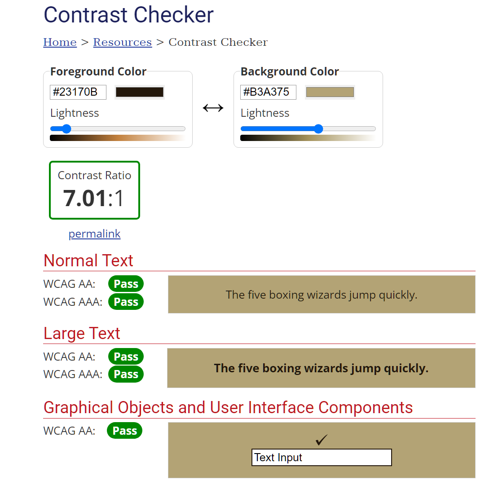

Header/Footer colour-scheme WebAIM test 

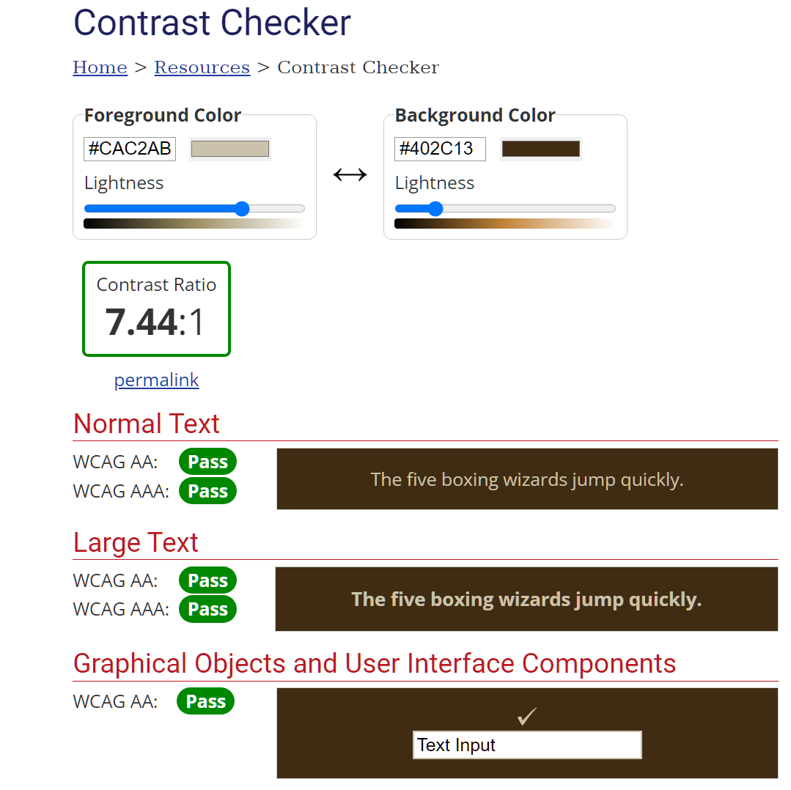

Main colour scheme WebAIM test 

 

### Fonts
Playfair-Display  with cursive as fallback was used for all text as to match the font used on the physical menu.

### Structure
The page uses a often used and easily recognized layout. 
A navigation bar is pinned to the top of every page providing easy navigation. At the bottom of the screen users wil find the footer providing a clear secondary link to the contact section and links to the restaurants social media acounts.

The website consists of five separate pages: 
- A homepage wich offers a view of the terras from one of the tables.
- An about page with the "About Us" tekst and an indoor shot of the restaurant.
- A menu page with its own side-bar for easy navigation to the different menu sections.
- A image gallery with images taken at the restaurant aswell as general inspiring pictures of food and food preparation.
- A contact page with a contact/reservation form, a map and the resaurant's location and contact information.

### Wireframes

Home

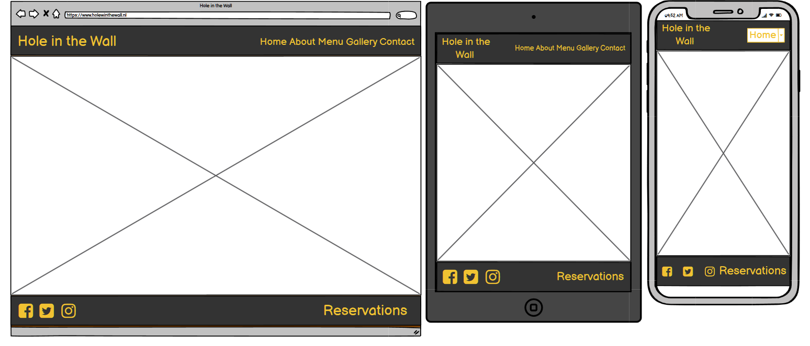

About

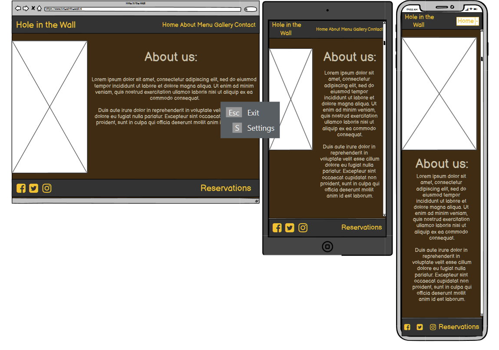

Menu

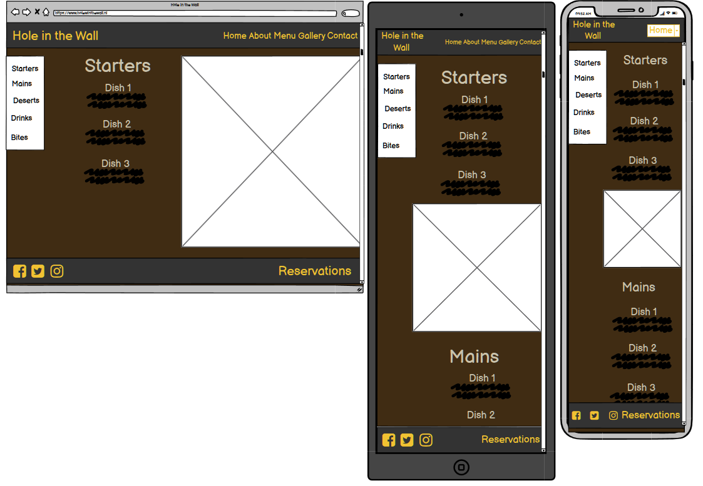

Gallery

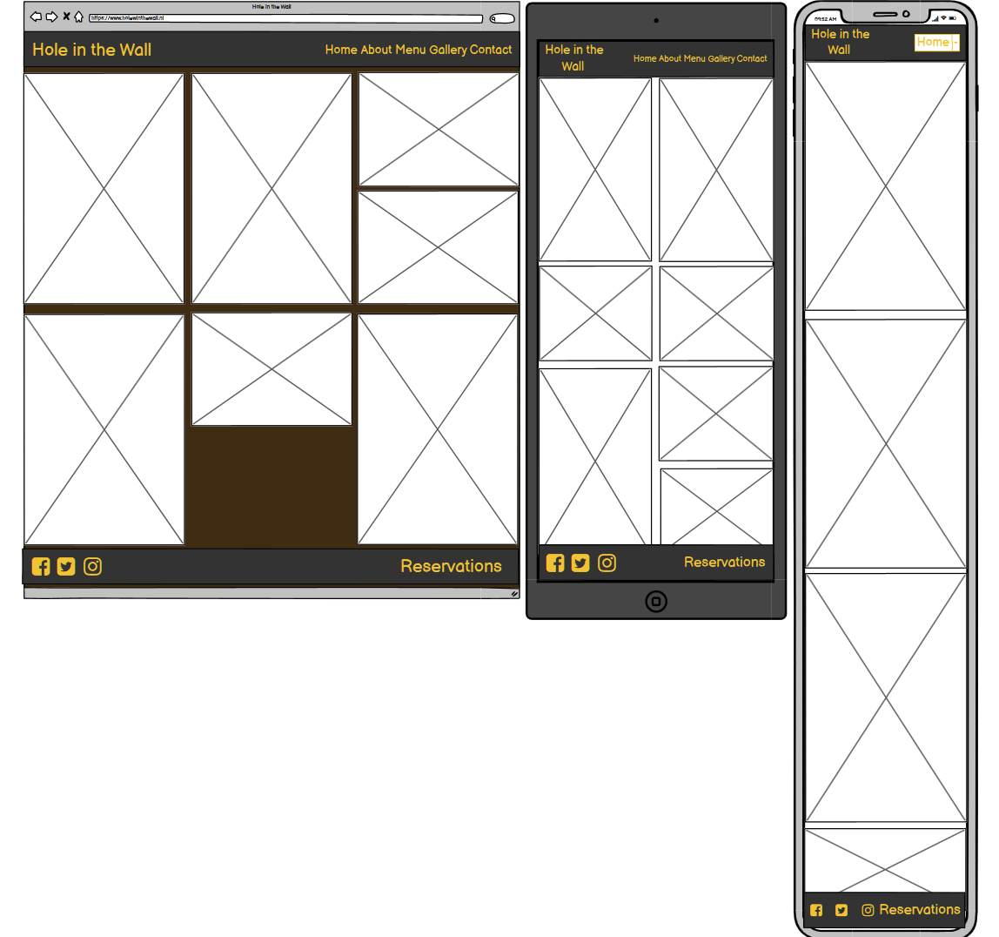

Contact

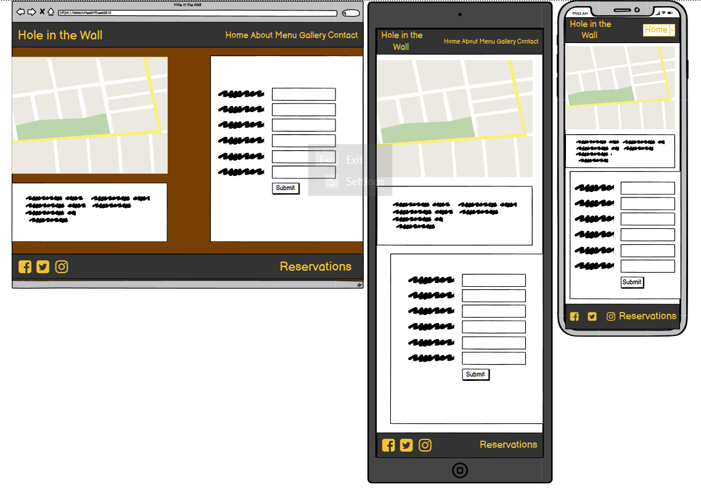

 

## Technologies Used

### Languages
- HTML
- CSS

### Frameworks & Tools
- GitHub
- Gitpod
- Gimp 2.10
- Balsamiq
- Swatcher
- Font Awsome
- Google Fonts

## Features
The page consists of five pages and 9 features

### Logo and Navigation Bar
- Featured on all five pages
- The navbar is fully responsive and changes to a dropdown menu on smaller screens and includes
links to the Homepage, About page, Menu page, Gallery and Contact  page
- It allows users to easily navigate the page
- The link for the page the user is currently on is highlighted 

### Footer
- Featured on all five pages
- Consists of two sections: social media links on the left and a quick-link to the contact section on the right.

 

### Homepage
- Main page with a picture of one og the restaurants tables with view of the terras. Giving a sense of the atmosphere providing welcoming first sight for new customers.

### About us
- Page with a short description of the restaurant and is't origin/inspiration. Picture of restaurant interior on the side.

### Menu
- Page displaying the restaurants full menu and pricing.
Divided into five sections (one for each category)
Includes a side bar for easy navigation between menu sections

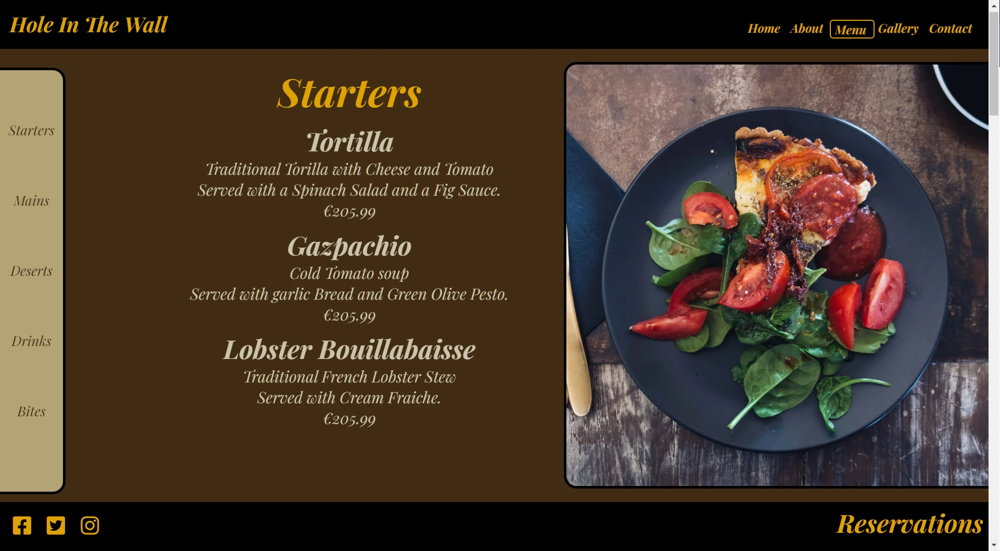

### Gallery
- Page displaying a selection of images of food and food preparation both from the restaurant and the owners private collection.

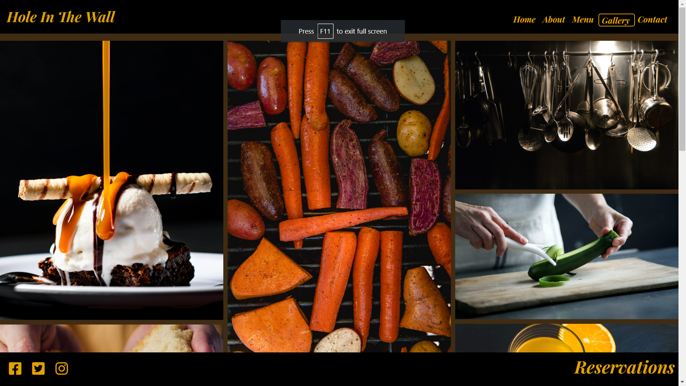

### Contact
- Page displaying an embedded google maps link pointing ot the restaurant location. A section containing adress and contact-info and a reservations-form allowing customers to reserve a table online.

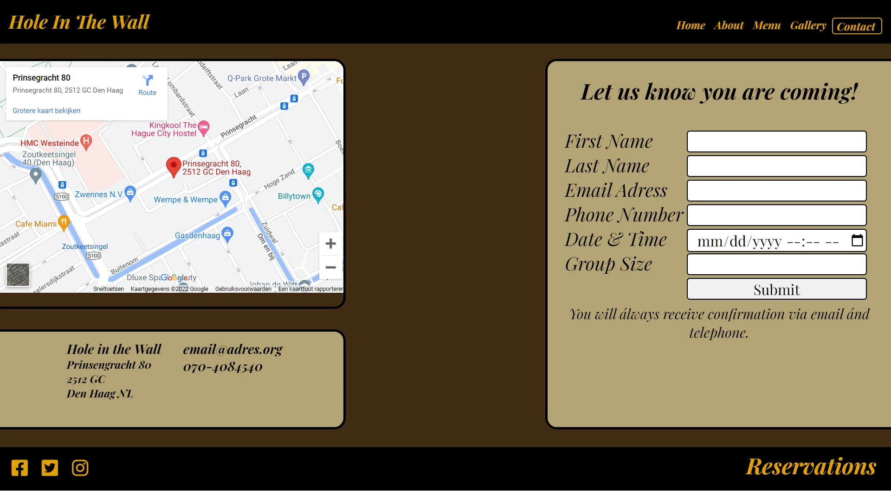