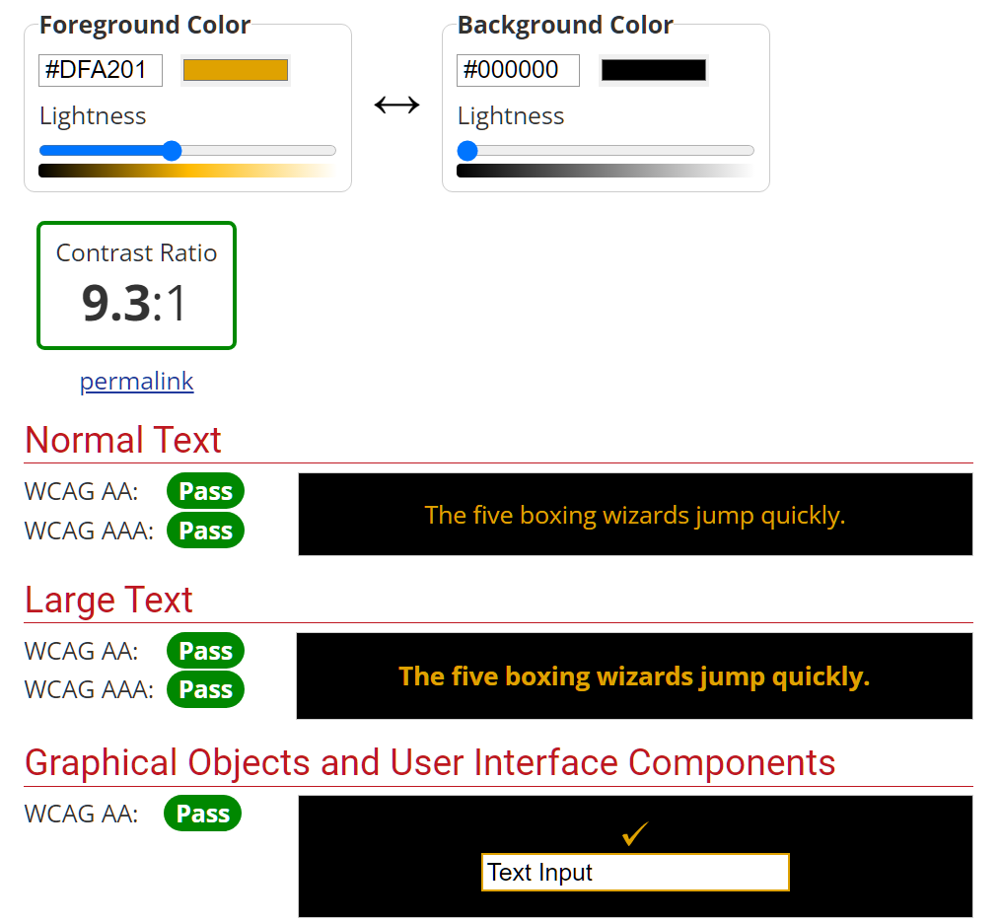
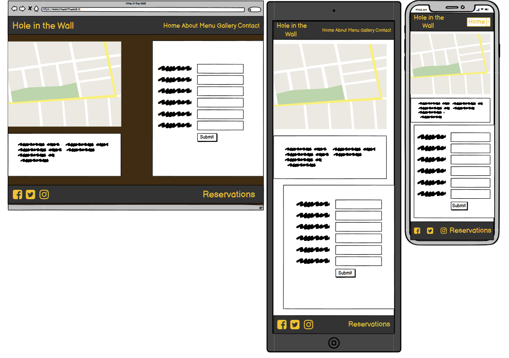
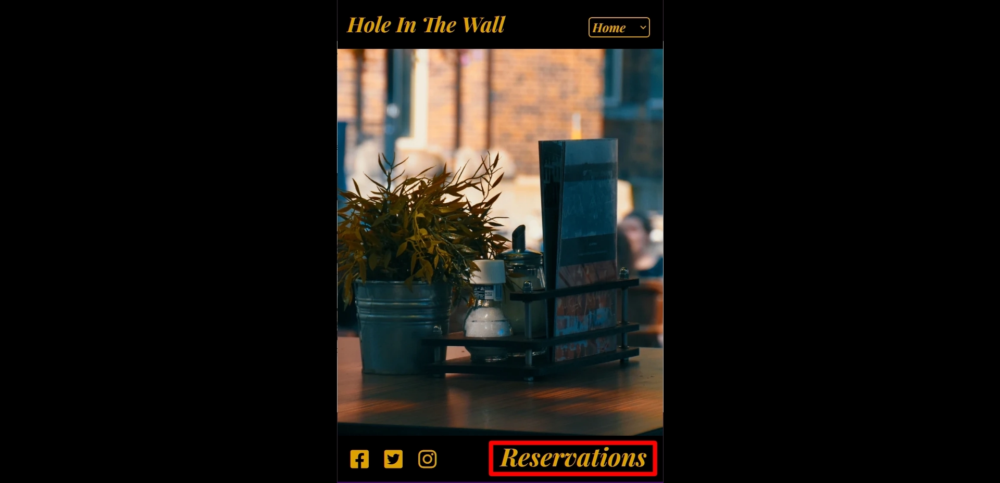

# Hole in the Wall
(Developer Gustaaf Milzink)

[Live webpage](https://g-milzink.github.io/CI_PP1_TR/index.html)

## Table of Content

1. [Project Goals](#project-goals)
    1. [User Goals](#user-goals)
    2. [Site Owner Goals](#site-owner-goals)
2. [User Experience](#user-experience)
    1. [Target Audience](#target-audience)
    2. [User Requrements and Expectations](#user-requrements-and-expectations)
    3. [User Stories](#user-stories)
3. [Design](#design)
    1. [Design Choices](#design-choices)
    2. [Colour](#colours)
    3. [Fonts](#fonts)
    4. [Structure](#structure)
    5. [Wireframes](#wireframes)
4. [Technologies Used](#technologies-used)
    1. [Languages](#languages)
    2. [Frameworks & Tools](#frameworks-&-tools)
5. [Features](#features)
6. [Testing](#validation)
    1. [HTML Validation](#HTML-validation)
    2. [CSS Validation](#CSS-validation)
    3. [Accessibility](#accessibility)
    4. [Performance](#performance)
    5. [Device testing](#performing-tests-on-various-devices)
    6. [Browser compatibility](#browser-compatability)
    7. [Testing user stories](#testing-user-stories)
8. [Bugs](#Bugs)
9. [Deployment](#deployment)
10. [Credits](#credits)
11. [Acknowledgements](#acknowledgements)

## Project Goals

### User Goals
- Finding a restaurant with an interesting kitchen and get a sense of the atmosphere.
- Having access to the full menu and pricing details.
- Finding extra information about the reastaurant.
- Finding the location of the restaurant.

### Site Owner Goals
- Atracting new customers to the restaurant.
- Presenting information about the restaurant to customers.
- Provide a quick way for new and existing customers to make reservations.
- Promoting the bussines.

## User Experience

### Target Audience
- People looking for a place to dine at

### User Requirements and Expectations

- A simple and intuitive navigation system.
- Links and functions that work as expected.
- Quickly and easily find relevant information.
- Good presentation and a visually appealing design regardless of screen size.
- An easy way to make a reservation.

### User Stories

#### First-time User 
1. As a first time user, I want to know the location of the restaurant.
2. As a first time user, I want to know more about the restaurant.
3. As a first time user, I want to know the resaurants menu.
4. As a first time user, I want to know the restaurant's price range.
5. As a first time user, I want to get a feel of the general atmosphere.

#### Returning User
6. As a returning user, I want to see the curent menu.
7. As a returnign user, I want to know the opening times.
8. As a returning user, I want to be able to quickly make reservations
9. As a returning user, I want to find the restaurant on social media
10. As a returning user, I want to get directions to the restaurant

#### Site Owner 
11. As the site owner, I want users to see our menu.
12. As the site owner, I want users to get to know the restaurant. 
13. As the site owner, I want the users to be able to contact us.
14. As the site owner, I want the users to find our social-media acounts.
15. As the site owner, I want to provide returning customers with an easy way to make a reservation.
16. As site owner I do not want customers to have to use the back button to return to the site after an error.

## Design

### Design Choices
The design of the website is tailored towards giving a sense of the atmosphere in the restaurant, a warm and cozy place but with a touch of class.
Sharp corners have been avoided to give a welcoming appearance.
Several Images and interactive elements have rounded corners on the inside and are purposefully cut of by the edge of the screen.

### Colour
The colour scheme was chosen to match the colours used in the restaurant.  
Contrast has been tested on WebAIM and colours have been adapted where necessary to ensure legibility.
 

Main colour-scheme WebAIM test 

Header/Footer colour-scheme WebAIM test 

Main colour scheme WebAIM test 

 

### Fonts
Playfair-Display  with cursive as fallback was used for all text as to match the font used on the physical menu.

### Structure
The page uses a often used and easily recognized layout. 
A navigation bar is pinned to the top of every page providing easy navigation. At the bottom of the screen users wil find the footer providing a clear secondary link to the contact section (especially at lower resolutions where it removes the need to use the dropdown menu for customers who quickly want to book a table "on the go") and links to the restaurants social media acounts.

The website consists of five separate pages: 
- A homepage wich offers a view of the terras from one of the tables.
- An about page with the "About Us" tekst and an indoor shot of the restaurant.
- A menu page with its own side-bar for easy navigation to the different menu sections.
- A image gallery with images taken at the restaurant as well as general inspiring pictures of food and food preparation.
- A contact page with a contact/reservation form, a map and the resaurant's location and contact information.

### Wireframes

Home

About

Menu

Gallery

Contact

404

 

## Technologies Used

### Languages
- HTML
- CSS
- JS (code snippet in header code to make dropdown menu change current page)

### Frameworks & Tools
- GitHub
- Git Bash
- Gitpod
- Gimp 2.10
- Balsamiq
- Swatcher
- Font Awsome
- Google Fonts
- Favicon

## Features
The page consists of five pages and 9 features

### Logo and Navigation Bar
- Featured on all five pages
- The navbar is fully responsive and changes to a dropdown menu on smaller screens and includes
links to the Homepage, About page, Menu page, Gallery and Contact  page
- It allows users to easily navigate the page
- The link for the page the user is currently on is highlighted 
- user stories covered: 2, 12

### Footer
- Featured on all five pages
- Consists of two sections: social media links on the left and a quick-link to the contact section on the right.
- user stories covered: 7, 9, 14, 15
 

### Homepage
- Main page with a picture of one of the restaurants tables with view of the terras. Giving a sense of the atmosphere providing welcoming first sight for new customers.
- user stories covered: 2, 13

### About us
- Page with a short description of the restaurant and is't origin/inspiration. Picture of restaurant interior on the left side of the screen.
- user stories covered: 2, 13

### Menu
- Page displaying the restaurants full menu and pricing.
Divided into five sections (one for each category)
Includes a side bar for easy navigation between menu sections
- user stories covered:3,4, 6, 12 

### Gallery
- Page displaying a selection of images of food and food preparation both from the restaurant and the owners private collection.
- user stories covered: 2, 13

### Contact
- Page displaying an embedded google maps link pointing ot the restaurant location. A section containing adress and contact-info and a reservations-form allowing customers to reserve a table online.
- user stories covered:1, 7, 8, 14, 15

## Validation

### HTML Validation
The W3C Markup Validation Service was used to validate the HTML of the website. All pages pass without errors or warnings.

Home

About

Menu

Gallery

Contact

404

### CSS Validation

The W3C Jigsaw CSS Validation Service was used to validate the CSS of the website. All CSS passed without errors.

whole page

style.css

### Accessibility
WAVE accessibility evaluation tool was used to ensure the website met high accessibility standards. All pages pass with 0 errors.
A single alert was flagged.
- The dropdown menu for navigation on at lower resolution can cause inconsistent behaviour while navigation by keys in some browsers.

Home

About

Menu

Gallery
git status

Contact

404

### Performance 
Google Lighthouse in Google Chrome Developer Tools was used to test the performance of the website. 

Home

About

Menu

Gallery

Contact

404

### Performing tests on various devices 
The website was tested on the following devices:
- Samsung A40 smartphone
- HP 14s-fq0050nd AMD Ryzen 3 3250U 14" laptop
- Generic Desktop PC

Testing with Google Chrome Develepor Tools Device Toggling reveals that the site remains functional and esthetically consistent across all devices.

### Browser compatability
The website was tested on the following browsers:
- Google Chrome
- Mozilla Firefox
- Microsoft Egde

### Testing user stories

1. As a first time user, I want to know the location of the restaurant.

| **Feature** | **Action** | **Expected Result** | **Actual Result** |
|-------------|------------|---------------------|-------------------|
|Map|Locate Google map on contact page| Find map showing location of restaurant|Works As expected|
|Adres section|Locate adres info|Find restaurant adress|Works as expected|

Screenshot

2. As a first time user, I want to know more about the restaurant.

| **Feature** | **Action** | **Expected Result** | **Actual Result** |
|-------------|------------|---------------------|-------------------|
|About us page|Look for information on the restaurant|Find information on the restaurant|works as expected|

Screenshot

3. As a first time user, I want to know the resaurants menu.

| **Feature** | **Action** | **Expected Result** | **Actual Result** |
|-------------|------------|---------------------|-------------------|
|Menu page|Navigate to the menu|Find the menu|Works as expected|

Screenshot

4. As a first time user, I want to know the restaurant's price range.

| **Feature** | **Action** | **Expected Result** | **Actual Result** |
|-------------|------------|---------------------|-------------------|
|Menu page|Navigate to the menu|Find the menu|Works as expected|

Screenshot

5. As a first time user, I want to get a feel of the general atmosphere.

| **Feature** | **Action** | **Expected Result** | **Actual Result** |
|-------------|------------|---------------------|-------------------|
|Homepage|Visit Website|See image of restaurant|Works as expected|
|About page|Navigate to about page|See restaurant interior|Works as expected|
|Gallery page|Navigate to gallery gallery page|Find pictures of the restaurant|Works as expected|

Screenshot

6. As a returning user, I want to see the curent menu.

| **Feature** | **Action** | **Expected Result** | **Actual Result** |
|-------------|------------|---------------------|-------------------|
|Menu page|Navigate to the menu|Find the menu|Works as expected|

Screenshot

7. As a returnign user, I want to know the opening times.

| **Feature** | **Action** | **Expected Result** | **Actual Result** |
|-------------|------------|---------------------|-------------------|
|Contact Page|Navigate to contact page|Find opening times|Works as expected|

Screenshot

Screenshot

8. As a returning user, I want to be able to quickly make reservations

| **Feature** | **Action** | **Expected Result** | **Actual Result** |
|-------------|------------|---------------------|-------------------|
|Reservations form|Navigate to contact page|find reservation form and contact info|Works as expected|

Screenshot

9. As a returning user, I want to find the restaurant on social media

| **Feature** | **Action** | **Expected Result** | **Actual Result** |
|-------------|------------|---------------------|-------------------|
|footer|Visit website|Find social media links|Works as expected|

Screenshot

10. As a returning user, I want to get directions to the restaurant

| **Feature** | **Action** | **Expected Result** | **Actual Result** |
|-------------|------------|---------------------|-------------------|
|map|navigate to contact page|Find map with location of restaurant|Works as expected|
|Adress section|Navigate to contact page|Find restaurant adress|Works as expected|

Screenshot

11. As the site owner, I want users to see our menu.

| **Feature** | **Action** | **Expected Result** | **Actual Result** |
|-------------|------------|---------------------|-------------------|
|Menu page|Navigate to the menu|Find the menu|Works as expected|

Screenshot

12. As the site owner, I want users to get to know the restaurant.

| **Feature** | **Action** | **Expected Result** | **Actual Result** |
|-------------|------------|---------------------|-------------------|
|Homepage|Visit Website|See image of restaurant|Works as expected|
|About page|Navigate to about page|See restaurant interior|Works as expected|
|Gallery page|Navigate to gallery gallery page|Find pictures of the restaurant|Works as expected|

Screenshot

13. As the site owner, I want the users to be able to contact us.

| **Feature** | **Action** | **Expected Result** | **Actual Result** |
|-------------|------------|---------------------|-------------------|
|Contact page|Navigate to contact page|Find contact info and reservations form|Works as expected|

Screenshot

14. As the site owner, I want the users to find our social-media acounts.

| **Feature** | **Action** | **Expected Result** | **Actual Result** |
|-------------|------------|---------------------|-------------------|
|footer|Visit|Find social media links|Works as expected|

Screenshot

15. As the site owner, I want to provide returning customers with an easy way to make a reservation.

| **Feature** | **Action** | **Expected Result** | **Actual Result** |
|-------------|------------|---------------------|-------------------|
|Reservation form|Navigate to contact page |Find online reservation form|Works as expected|

Screenshot

16. As site owner I do not want customers to have to use the back button to return to the site after an error.

| **Feature** | **Action** | **Expected Result** | **Actual Result** |
|-------------|------------|---------------------|-------------------|
|Custom 404 page|User attempts to navigate to non existing page|Custom 404-page is shown|Works as expected|

Screenshot

## Deployment
The website was deployed using GitHub Pages by following these steps:
1. Go to the GitHub repository and navigate to the Settings tab.
2. Scroll down and select Pages in the menu on the left.
3. For the source select Branch: main
4. The page will refresh after some time and a message wil be displayed: "Your site is published at https://g-milzink.github.io/CI_PP1_TR/

You can for fork the repository by following these steps:
1. Go to the GitHub repository
2. Click on Fork button in upper right hand corner

You can clone the repository by following these steps:
1. Go to the GitHub repository 
2. Locate the Code button above the list of files and click it 
3. Select if you prefere to clone using HTTPS, SSH, or Github CLI and click the copy button to copy the URL to your clipboard
4. Open Git Bash
5. Change the current working directory to the one where you want the cloned directory to be
6. Type git clone and paste the URL from the clipboard ($ git clone https://github.com/YOUR-USERNAME/YOUR-REPOSITORY)
7. Press Enter to create your local clone.

## Credits

### Media

- [Homepage background](assets/images/terras-table_1920-900.webp): Photo by <a href="https://unsplash.com/@ryancp?utm_source=unsplash&utm_medium=referral&utm_content=creditCopyText">Ryan Plomp</a> on <a href="https://unsplash.com/collections/455476/restaurant?utm_source=unsplash&utm_medium=referral&utm_content=creditCopyText">Unsplash</a>

- [About page image](assets/images/indoor-shot_1000x1500.webp):Photo by <a href="https://unsplash.com/es/@adrienolichon?utm_source=unsplash&utm_medium=referral&utm_content=creditCopyText">Adrien Olichon</a> on <a href="https://unsplash.com/collections/2443767/featured?utm_source=unsplash&utm_medium=referral&utm_content=creditCopyText">Unsplash</a>

- [Menu - Starters image](assets/images/menu/starters-img.webp): Photo by <a href="https://unsplash.com/es/@sugercoatit?utm_source=unsplash&utm_medium=referral&utm_content=creditCopyText">Melissa Walker Horn</a> on <a href="https://unsplash.com/@sugercoatit?utm_source=unsplash&utm_medium=referral&utm_content=creditCopyText">Unsplash</a>

- [Menu - Mains image](assets/images/menu/mains-img.webp): Photo by <a href="https://unsplash.com/@grisskitchen?utm_source=unsplash&utm_medium=referral&utm_content=creditCopyText">Max Griss</a> on <a href="https://unsplash.com/@grisskitchen?utm_source=unsplash&utm_medium=referral&utm_content=creditCopyText">Unsplash</a>

- [Menu - Deserts image](assets/images/menu/deserts-img.webp): Photo by <a href="https://unsplash.com/@nasmit?utm_source=unsplash&utm_medium=referral&utm_content=creditCopyText">Nasia M.</a> on <a href="https://unsplash.com/s/photos/chocolate-desert?utm_source=unsplash&utm_medium=referral&utm_content=creditCopyText">Unsplash</a>

- [Menu - Drinks image](assets/images/menu/drinks-img.webp): Photo by <a href="https://unsplash.com/@sugercoatit?utm_source=unsplash&utm_medium=referral&utm_content=creditCopyText">Melissa Walker Horn</a> on <a href="https://unsplash.com/s/photos/drinks-selection?utm_source=unsplash&utm_medium=referral&utm_content=creditCopyText">Unsplash</a>

- [Menu - Bites image](assets/images/menu/bites-img.webp): Photo by <a href="https://unsplash.com/@jeztimms?utm_source=unsplash&utm_medium=referral&utm_content=creditCopyText">Jez Timms</a> on <a href="https://unsplash.com/s/photos/cheese?utm_source=unsplash&utm_medium=referral&utm_content=creditCopyText">Unsplash</a>

- [Gallery image](assets/images/gallery/caramel-desert.webp): Photo by <a href="https://unsplash.com/@kobbyfotos?utm_source=unsplash&utm_medium=referral&utm_content=creditCopyText">Kobby Mendez</a> on <a href="https://unsplash.com/s/photos/food?utm_source=unsplash&utm_medium=referral&utm_content=creditCopyText">Unsplash</a>

- [Gallery image](assets/images/gallery/cut-bread.webp): Photo by <a href="https://unsplash.com/es/@bartoshevicz?utm_source=unsplash&utm_medium=referral&utm_content=creditCopyText">Adam Bartoszewicz</a> on <a href="https://unsplash.com/s/photos/food-preparation?utm_source=unsplash&utm_medium=referral&utm_content=creditCopyText">Unsplash</a>

- [Gallery image](assets/images/gallery/cutting-veg.webp): Photo by <a href="https://unsplash.com/@maxdelsid?utm_source=unsplash&utm_medium=referral&utm_content=creditCopyText">Max Delsid</a> on <a href="https://unsplash.com/s/photos/food-preparation?utm_source=unsplash&utm_medium=referral&utm_content=creditCopyText">Unsplash</a> 

- [Gallery image](assets/images/gallery/grilled-veg.webp): Photo by <a href="https://unsplash.com/@othentikisra?utm_source=unsplash&utm_medium=referral&utm_content=creditCopyText">israel palacio</a> on <a href="https://unsplash.com/s/photos/food-preparation?utm_source=unsplash&utm_medium=referral&utm_content=creditCopyText">Unsplash</a>

- [Gallery image](assets/images/gallery/fresh-bowl.webp): Photo by <a href="https://unsplash.com/@pwign?utm_source=unsplash&utm_medium=referral&utm_content=creditCopyText">Anh Nguyen</a> on <a href="https://unsplash.com/s/photos/food?utm_source=unsplash&utm_medium=referral&utm_content=creditCopyText">Unsplash</a>

- [Gallery image](assets/images/gallery/eggplant-dish_cuttingboard.webp): Photo by <a href="https://unsplash.com/@nobiteuntilphoto?utm_source=unsplash&utm_medium=referral&utm_content=creditCopyText">Mariana Medvedeva</a> on <a href="https://unsplash.com/s/photos/food?utm_source=unsplash&utm_medium=referral&utm_content=creditCopyText">Unsplash</a>

- [Gallery image](assets/images/gallery/kitchen-tools.webp): Photo by <a href="https://unsplash.com/@hjkp?utm_source=unsplash&utm_medium=referral&utm_content=creditCopyText">henry perks</a> on <a href="https://unsplash.com/s/photos/food-preparation?utm_source=unsplash&utm_medium=referral&utm_content=creditCopyText">Unsplash</a>

- [Gallery image](assets/images/gallery/peeling-courgette.webp): Photo by <a href="https://unsplash.com/@ca_creative?utm_source=unsplash&utm_medium=referral&utm_content=creditCopyText">CA Creative</a> on <a href="https://unsplash.com/s/photos/food-preparation?utm_source=unsplash&utm_medium=referral&utm_content=creditCopyText">Unsplash</a>

- [Gallery image](assets/images/gallery/salad-orange-juice.webp): Photo by <a href="https://unsplash.com/@shootdelicious?utm_source=unsplash&utm_medium=referral&utm_content=creditCopyText">Eiliv-Sonas Aceron</a> on <a href="https://unsplash.com/s/photos/food?utm_source=unsplash&utm_medium=referral&utm_content=creditCopyText">Unsplash</a>

- [Gallery image](assets/images/gallery/vegan-meal.webp): Photo by <a href="https://unsplash.com/@brookelark?utm_source=unsplash&utm_medium=referral&utm_content=creditCopyText">Brooke Lark</a> on <a href="https://unsplash.com/s/photos/food?utm_source=unsplash&utm_medium=referral&utm_content=creditCopyText">Unsplash</a>

### Code

- Code snippet to make dropdown menu change current page taken from: https://stackoverflow.com/questions/24582056/html-select-menu-as-navigation-menu

## Acknowledgements
I would like to take the opportunity to thank:
- My mentor Mo Shami for his feedback, advice, guidance and support.
- My partner Geertje van der Zalm for her support, inspiration and patience.
- My mother Anne Rijsdijk and her husband Mickel Pereira for allowing me to persue this dream.
- Anyone who spends time on the internet awnsering questions and helping others to learn.

  